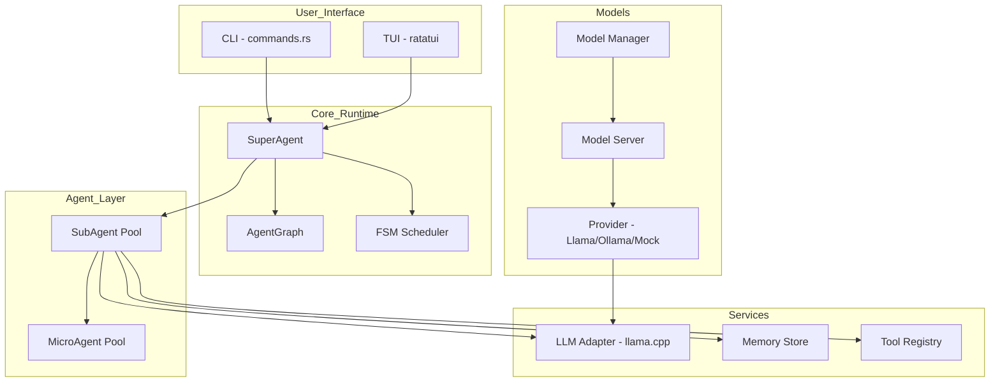
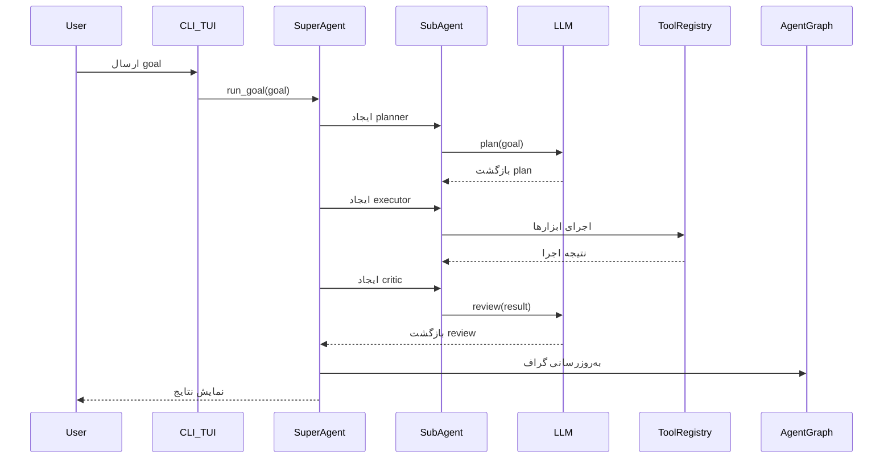

# گزارش جامع تحلیل پروژه Super-Agent v0.1

## فهرست مطالب
1. [ساختار درختی پروژه](#1-ساختار-درختی-پروژه)
2. [معماری و طراحی سیستم](#2-معماری-و-طراحی-سیستم)
3. [تحلیل لایه‌های پروژه](#3-تحلیل-لایه‌های-پروژه)
4. [ارزیابی کیفیت کدنویسی](#4-ارزیابی-کیفیت-کدنویسی)
5. [مشکلات و ایرادات شناسایی‌شده](#5-مشکلات-و-ایرادات-شناسایی‌شده)
6. [بررسی عملکرد و کارایی](#6-بررسی-عملکرد-و-کارایی)
7. [پیشنهادات مهندسی و حرفه‌ای](#7-پیشنهادات-مهندسی-و-حرفه‌ای)
8. [نتیجه‌گیری](#8-نتیجه‌گیری)

---

## 1. ساختار درختی پروژه

```
super-agent/
├── Cargo.toml
├── README.md
├── docs/
│   ├── DEVELOPMENT_FA.md
│   └── MODEL_SERVICE_FA.md
└── src/
    ├── main.rs
    ├── types.rs
    ├── config.rs
    ├── cli/
    │   ├── mod.rs
    │   └── commands.rs
    ├── tui/
    │   ├── mod.rs
    │   ├── app.rs
    │   └── layout.rs
    ├── agent/
    │   ├── mod.rs
    │   ├── super_agent.rs
    │   ├── sub_agent.rs
    │   └── micro_agent.rs
    ├── graph/
    │   ├── mod.rs
    │   ├── dag.rs
    │   └── fsm.rs
    ├── llm/
    │   ├── mod.rs
    │   ├── llama.rs
    │   └── mock.rs
    ├── memory/
    │   ├── mod.rs
    │   └── store.rs
    ├── tools/
    │   ├── mod.rs
    │   └── registry.rs
    └── models/
        ├── mod.rs
        ├── manager.rs
        └── server.rs
```

### تحلیل ساختار:
- **ساختار ماژولار**: پروژه به 10 ماژول اصلی تقسیم شده است
- **جداسازی مسئولیت‌ها**: هر ماژول مسئولیت خاصی دارد
- **قابلیت گسترش**: طراحی امکان افزودن ویژگی‌های جدید را فراهم می‌کند

---

## 2. معماری و طراحی سیستم

### 2.1 نمودار معماری کلی



### 2.2 معماری لایه‌ای

| لایه | مسئولیت | فایل‌های مرتبط |
|------|---------|---------------|
| **Presentation Layer** | CLI و TUI | `cli/`, `tui/` |
| **Orchestration Layer** | هماهنگی عامل‌ها | `agent/super_agent.rs` |
| **Agent Runtime Layer** | اجرای عامل‌ها | `agent/sub_agent.rs`, `agent/micro_agent.rs` |
| **Service Layer** | سرویس‌های زیربنایی | `llm/`, `memory/`, `tools/` |
| **Model Layer** | مدیریت مدل‌ها | `models/` |
| **Graph Layer** | گراف و FSM | `graph/` |

### 2.3 جریان کاری سیستم



### 2.4 نقاط قوت معماری

1. **طراحی ماژولار**: جداسازی مناسب مسئولیت‌ها
2. **استفاده از trait**: قابلیت جایگزینی پیاده‌سازی‌ها (`Llm`, `Tool`, `Provider`)
3. **پشتیبانی از TUI**: رابط کاربری متنی غنی با ratatui
4. **مدیریت حافظه**: پشتیبانی از short-term و long-term memory
5. **استفاده از async/await**: عملکرد غیرهمزمان با tokio

---

## 3. تحلیل لایه‌های پروژه

### 3.1 لایه CLI و Commands

**فایل:** [`src/cli/commands.rs`](src/cli/commands.rs)

```rust
#[derive(Parser, Debug)]
#[command(name = "agent")]
pub struct Commands {
    #[command(subcommand)]
    pub command: Cmd,
}

#[derive(Subcommand, Debug)]
pub enum Cmd {
    Run { #[arg(short, long)] goal: String },
    Chat,
    Graph,
    Logs,
    Tui,
    Exit,
    Models { #[command(subcommand)] cmd: ModelCmd },
}
```

**تحلیل:**
- استفاده از `clap` برای parsing دستورات
- ساختار مناسب برای گسترش دستورات
- پشتیبانی از subcommands

### 3.2 لایه TUI

**فایل:** [`src/tui/app.rs`](src/tui/app.rs)

**ویژگی‌های پیاده‌سازی‌شده:**
- 10 تم رنگ‌بندی حرفه‌ای
- Command Palette با `/`
- پنل مدیریت مدل‌ها با `m`
- پشتیبانی از import مدل با `i`
- ذخیره‌سازی تنظیمات با `Ctrl-s`

**مشکلات:**
- استفاده از `unwrap()` در چندینجا (خط 79، 237، 280)
- کد تکراری در handling رویدادها
- پیچیدگی زیاد در متد `run()`

### 3.3 لایه Agent

**فایل‌ها:**
- [`src/agent/super_agent.rs`](src/agent/super_agent.rs)
- [`src/agent/sub_agent.rs`](src/agent/sub_agent.rs)
- [`src/agent/micro_agent.rs`](src/agent/micro_agent.rs)

**ساختار SuperAgent:**
```rust
pub struct SuperAgent {
    pub graph: AgentGraph,
    pub scheduler: AgentState,
    pub llm: Arc<dyn Llm>,
}
```

**جریان کاری:**
1. **Planning**: ایجاد planner SubAgent و دریافت plan از LLM
2. **Executing**: ایجاد executor SubAgent و اجرای plan
3. **Reviewing**: ایجاد critic SubAgent و بررسی نتیجه

### 3.4 لایه Graph و FSM

**فایل:** [`src/graph/fsm.rs`](src/graph/fsm.rs)

```rust
pub fn transition(current: &AgentState, next: &AgentState) -> bool {
    match (current, next) {
        (AgentState::Idle, AgentState::Planning) => true,
        (AgentState::Planning, AgentState::Executing) => true,
        (AgentState::Executing, AgentState::Reviewing) => true,
        (AgentState::Reviewing, AgentState::Completed) => true,
        (_, AgentState::Failed) => true,
        _ => false,
    }
}
```

**تحلیل:**
- FSM ساده و مؤثر
- قابلیت گسترش برای حالات بیشتر
- عدم استفاده کامل از قابلیت‌های `petgraph`

### 3.5 لایه LLM

**فایل:** [`src/llm/llama.rs`](src/llm/llama.rs)

**نقاط قوت:**
- طراحی مبتنی بر trait (`async_trait`)
- پشتیبانی از Mock برای تست
- مدیریت خطا با `thiserror`

**نقاط ضعف:**
- عدم پشتیبانی از streaming
- وابستگی به فرمت ثابت OpenAI

### 3.6 لایه Models

**فایل:** [`src/models/server.rs`](src/models/server.rs)

**Provider Trait:**
```rust
#[async_trait]
pub trait Provider: Send + Sync {
    fn name(&self) -> &'static str;
    async fn start(&self) -> anyhow::Result<()>;
    async fn stop(&self) -> anyhow::Result<()>;
    async fn is_running(&self) -> bool;
    async fn chat(&self, messages: &[Message]) -> anyhow::Result<String>;
}
```

**تحلیل:**
- طراحی مناسب برای پشتیبانی از providerهای مختلف
- پیاده‌سازی Mock کامل
- پیاده‌سازی LlamaProvider در حد پایه

### 3.7 لایه Memory

**فایل:** [`src/memory/store.rs`](src/memory/store.rs)

**ساختار:**
```rust
pub struct MemoryStore {
    inner: Arc<RwLock<Inner>>,
}

struct Inner {
    pub short_term: Vec<Message>,
    pub long_term: Vec<Message>,
}
```

**نقاط قوت:**
- Thread-safe با `parking_lot::RwLock`
- جداسازی short-term و long-term

**نقاط ضعف:**
- عدم persistence (در v0.1)
- عدم محدودیت اندازه حافظه

### 3.8 لایه Tools

**فایل:** [`src/tools/registry.rs`](src/tools/registry.rs)

**ساختار:**
```rust
pub trait Tool: Send + Sync {
    fn name(&self) -> &'static str;
    fn description(&self) -> &'static str;
    fn run(&self, input: AgentInput) -> ToolResult;
}
```

**تحلیل:**
- طراحی ساده و کارآمد
- پشتیبانی از ثبت ابزارهای دلخواه
- فقط یک ابزار نمونه (EchoTool)

---

## 4. ارزیابی کیفیت کدنویسی

### 4.1 امتیاز کلی: 6.5/10

### 4.2 جدول شاخص‌های کیفیت

| شاخص | وضعیت | توضیحات |
|------|--------|---------|
| **نام‌گذاری** | خوب | نام‌های واضح و معنادار |
| **تست‌ها** | متوسط | فقط چند تست unit |
| **مستندسازی** | متوسط | doc comments ناقص |
| **مدیریت خطا** | متوسط | استفاده از `anyhow` اما `unwrap()` در جاهایی |
| **کپسوله‌سازی** | متوسط | برخی فیلدهای public غیرضروری |
| **قابلیت استفاده مجدد** | خوب | trait-based design |
| **پیچیدگی** | متوسط | برخی توابع خیلی طولانی |

### 4.3 مثال‌های کد با کیفیت

**1. استفاده از Trait برای قابلیت جایگزینی:**
```rust
#[async_trait]
pub trait Llm: Send + Sync {
    async fn chat(&self, messages: &[Message]) -> anyhow::Result<String>;
}

// پیاده‌سازی‌ها:
impl Llm for LlamaClient { ... }
impl Llm for MockLlm { ... }
```

**2. استفاده از Arc<RwLock<>> برای thread-safety:**
```rust
pub struct MemoryStore {
    inner: Arc<RwLock<Inner>>,
}
```

**3. طراحی ماژولار:**
```rust
pub struct SubAgent {
    pub id: AgentId,
    pub role: String,
    pub memory: MemoryStore,
    pub tools: ToolRegistry,
    pub llm: Arc<dyn Llm>,
}
```

### 4.4 مثال‌های نیازمند بهبود

**1. استفاده از unwrap():**
```rust
// در src/tui/app.rs:79
let cfg = self.config.read().unwrap().clone();

// راه‌حل پیشنهادی:
let cfg = match self.config.read() {
    Ok(c) => c.clone(),
    Err(_) => return Ok(()),
};
```

**2. تابع طولانی (300+ خط):**
```rust
// در src/tui/app.rs:72-296
pub async fn run(&mut self) -> anyhow::Result<()> {
    // بیش از 300 خط کد
}
```

**3. کد تکراری:**
```rust
// در src/tui/app.rs:217-229
if self.palette_open {
    self.palette_query.push(c);
} else {
    self.input.push(c);
}
```

---

## 5. مشکلات و ایرادات شناسایی‌شده

### 5.1 مشکلات بحرانی

| شماره | مشکل | محل | اولویت |
|-------|------|-----|--------|
| 1 | تکرار تابع `path()` در config.rs | [`src/config.rs`](src/config.rs:48-70) | بحرانی |
| 2 | استفاده از unwrap() در TUI | [`src/tui/app.rs`](src/tui/app.rs) | بحرانی |
| 3 | عدم handling خطای async در SuperAgent | [`src/agent/super_agent.rs`](src/agent/super_agent.rs:47) | بالا |

### 5.2 مشکلات متوسط

| شماره | مشکل | محل | اولویت |
|-------|------|-----|--------|
| 4 | عدم streaming در LLM | [`src/llm/llama.rs`](src/llm/llama.rs) | بالا |
| 5 | عدم persistence در Memory | [`src/memory/store.rs`](src/memory/store.rs) | متوسط |
| 6 | مدیریت ضعیف عمر child process | [`src/models/server.rs`](src/models/server.rs:88) | متوسط |
| 7 | عدم validation ورودی در CLI | [`src/cli/commands.rs`](src/cli/commands.rs) | متوسط |

### 5.3 مشکلات جزئی

| شماره | مشکل | محل |
|-------|------|-----|
| 8 | نام‌گذاری ناهمگون متغیرها | کل پروژه |
| 9 | مستندات ناقص | بیشتر فایل‌ها |
| 10 | عدم استفاده کامل از clippy | کل پروژه |

### 5.4 باگ در config.rs

```rust
// خط 48-70 - تکرار تابع path()
impl RuntimeConfig {
    pub fn path() -> Option<PathBuf> { ... }  // اولین تعریف

    // ...

    pub fn path() -> Option<PathBuf> { ... }  // تکرار!
}
```

### 5.5 مشکل در SuperAgent::run_goal

```rust
let critique = critic.plan(&out.text).await.unwrap_or_else(|_| "no critique".into());
// استفاده از unwrap در مسیر اصلی برنامه
```

---

## 6. بررسی عملکرد و کارایی

### 6.1 وابستگی‌ها و تأثیر بر عملکرد

| کتابخانه | نسخه | کاربرد | تأثیر |
|----------|------|--------|-------|
| tokio | 1.34 | async runtime | بالا |
| reqwest | 0.11 | HTTP client | بالا |
| ratatui | 0.20 | TUI | متوسط |
| parking_lot | 0.12 | synchronization | کم |
| axum | 0.7 | HTTP server | متوسط |

### 6.2 نقاط کندی احتمالی

1. **HTTP Requests**: هر درخواست به LLM یک round-trip کامل دارد
2. **Memory Store**: Clone کردن Vec در هر دسترسی
3. **TUI Rendering**: redraw در هر tick (100ms)

### 6.3 بهینه‌سازی‌های پیشنهادی

**1. استفاده از connection pooling:**
```rust
// در LlamaClient
impl LlamaClient {
    pub fn new(endpoint: impl Into<String>, model: impl Into<String>) -> Self {
        Self {
            client: Client::builder()
                .pool_max_idle_per_host(5)
                .build(),
            endpoint: endpoint.into(),
            model: model.into(),
        }
    }
}
```

**2. کش کردن تنظیمات:**
```rust
// در TUI
impl TuiApp {
    fn should_redraw(&self) -> bool {
        // بررسی تغییرات قبل از redraw
    }
}
```

---

## 7. پیشنهادات مهندسی و حرفه‌ای

### 7.1 پیشنهادات کوتاه‌مدت (v0.1.x)

#### 1. رفع باگ config.rs
```rust
// حذف تکرار تابع path()
```

#### 2. حذف unwrap() از مسیر اصلی
```rust
// استفاده از ? operator و Propagate کردن خطاها
```

#### 3. افزودن تست‌های یکپارچه‌سازی
```rust
#[tokio::test]
async fn test_full_agent_flow() {
    // تست جریان کامل planner -> executor -> critic
}
```

### 7.2 پیشنهادات میان‌مدت (v0.2)

#### 1. پشتیبانی از Streaming
```rust
#[async_trait]
pub trait Llm: Send + Sync {
    async fn chat(&self, messages: &[Message]) -> anyhow::Result<String>;
    async fn chat_streaming(&self, messages: &[Message]) -> impl Stream<Item = anyhow::Result<String>>;
}
```

#### 2. Persistence برای Memory
```rust
// افزودن trait Persistence
trait Persistence {
    async fn save(&self, agent_id: &str, memory: &MemoryStore) -> anyhow::Result<()>;
    async fn load(&self, agent_id: &str) -> anyhow::Result<MemoryStore>;
}

// پیاده‌سازی‌ها:
impl Persistence for SqliteStore { ... }
impl Persistence for SledStore { ... }
```

#### 3. بهبود TUI
- جداسازی متد `run()` به توابع کوچک‌تر
- افزودن error handling مناسب
- استفاده از state machine برای handling events

### 7.3 پیشنهادات بلندمدت (v0.3+)

#### 1. پیاده‌سازی Native Provider
```rust
// استفاده از gguf crate برای بارگذاری مستقیم مدل‌ها
pub struct NativeProvider {
    model: GgufModel,
}

impl Provider for NativeProvider {
    async fn chat(&self, messages: &[Message]) -> anyhow::Result<String> {
        // inference مستقیم بدون نیاز به llama.cpp
    }
}
```

#### 2. قابلیت Multi-Agent پیشرفته
```rust
// پشتیبانی از agent hierarchies
pub struct AgentHierarchy {
    root: SuperAgent,
    children: Vec<SubAgent>,
    communication: ChannelManager,
}
```

#### 3. Tool Sandboxing
```rust
// محدودسازی دسترسی ابزارها
pub struct SandboxedTool<T: Tool> {
    inner: T,
    limits: ResourceLimits,
}
```

### 7.4 پیشنهادات معماری

#### 1. استفاده از Event Sourcing
```rust
// ذخیره تمام رویدادها برای debugging و replay
pub struct EventStore {
    events: Vec<AgentEvent>,
}
```

#### 2. افزودن Telemetry
```rust
// instrumentation با tracing
pub fn trace_agent_execution(goal: &str) {
    tracing::info!("Starting execution for: {}", goal);
    // ...
}
```

#### 3. Configuration Validation
```rust
// اعتبارسججی تنظیمات در زمان بارگذاری
impl RuntimeConfig {
    pub fn validate(&self) -> anyhow::Result<()> {
        if self.llm_endpoint.is_empty() {
            return Err(anyhow::anyhow!("LLM endpoint is required"));
        }
        // ...
    }
}
```

### 7.5 پیشنهادات کدنویسی

#### 1. استفاده از Result در TUI
```rust
// به جای unwrap()
match self.config.write() {
    Ok(mut cfg) => {
        cfg.theme = new_theme;
        if let Err(e) = cfg.save() {
            self.logs.push(format!("Save failed: {}", e));
        }
    }
    Err(e) => self.logs.push(format!("Lock failed: {}", e)),
}
```

#### 2. استخراج توابع کوچک‌تر
```rust
// در TUI::run()
async fn handle_key_event(&mut self, key: KeyEvent) -> anyhow::Result<()> {
    match key.code {
        KeyCode::Char('q') => self.handle_quit(),
        KeyCode::Char('m') => self.handle_models(),
        // ...
    }
}
```

#### 3. افزودن Error Context
```rust
// به جای anyhow::anyhow!(e.to_string())
anyhow::anyhow!("failed to execute plan: {}", e)
    .context(format!("plan: {}", plan))
```

---

## 8. نتیجه‌گیری

### 8.1 خلاصه تحلیل

**Super-Agent v0.1** یک پروژه Rust با طراحی ماژولار و معقول است که اهداف زیر را دنبال می‌کند:
- اجرای محلی (local-first) بدون وابستگی به سرویس‌های ابری
- پشتیبانی از TUI با ratatui
- معماری agent-based با قابلیت گسترش

### 8.2 نقاط قوت کلی

✅ طراحی ماژولار و جداسازی مسئولیت‌ها  
✅ استفاده از async/await و tokio  
✅ پشتیبانی از TUI با ویژگی‌های غنی  
✅ مستندات فارسی جامع  
✅ قابلیت گسترش با trait-based design  
✅ پشتیبانی از مدل‌های محلی  

### 8.3 نقاط ضعف کلی

❌ باگ در config.rs (تکرار تابع)  
❌ استفاده از unwrap() در مسیر اصلی  
❌ عدم streaming در LLM  
❌ عدم persistence در memory  
❌ تست‌های محدود  
❌ مستندات ناقص در کد  

### 8.4 توصیه نهایی

پروژه برای v0.1 وضعیت قابل قبولی دارد. برای رسیدن به v1.0، پیشنهاد می‌شود:

1. **اولویت اول**: رفع باگ‌های بحرانی (config.rs، unwrap)
2. **اولویت دوم**: افزودن streaming و persistence
3. **اولویت سوم**: گسترش تست‌ها و مستندسازی
4. **اولویت چهارم**: بهبود عملکرد و بهینه‌سازی

### 8.5 فاصله تا نسخه پایدار

| معیار | وضعیت فعلی | هدف |
|-------|------------|------|
| باگ‌های بحرانی | 2 | 0 |
| پوشش تست | ~20% | 70% |
| مستندات | 50% | 90% |
| streaming | ❌ | ✅ |
| persistence | ❌ | ✅ |
| native provider | ❌ | ✅ |

---

*گزارش تهیه‌شده در تاریخ: 2026-02-02*  
*تحلیل‌گر: Architect Mode - SuperCode AI*
