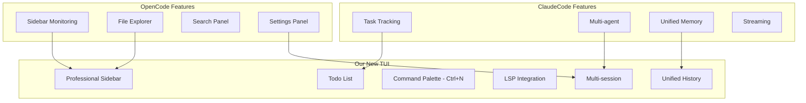
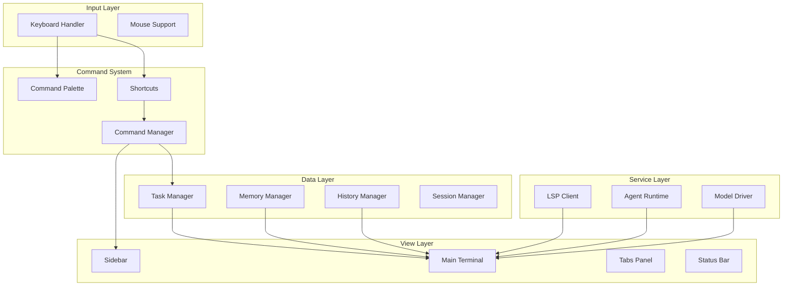
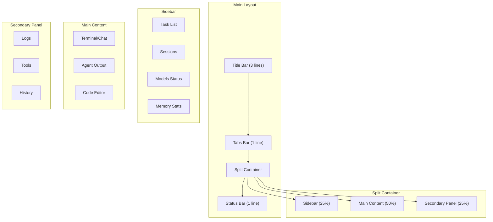
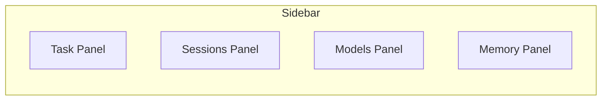
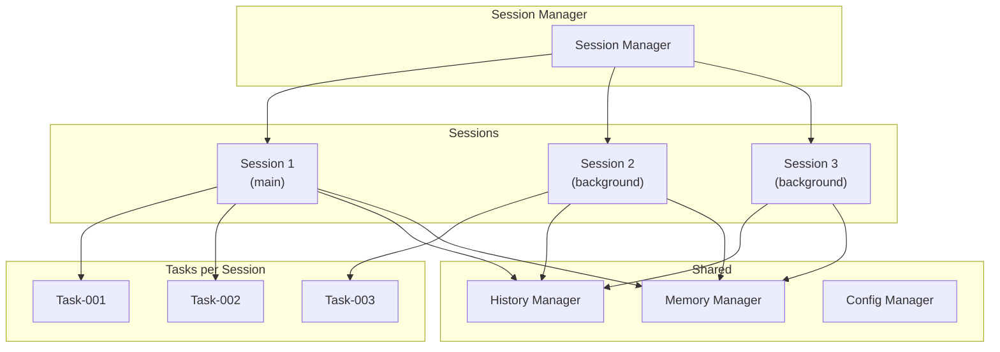
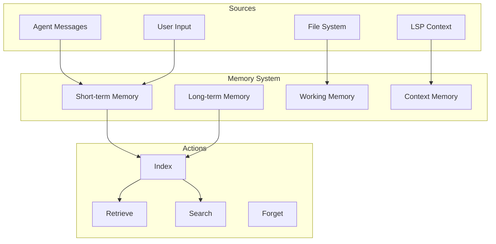
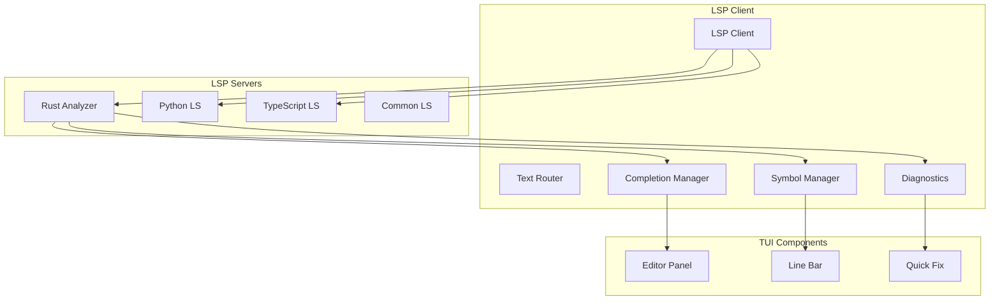

# برنامه جامع بازطراحی TUI - نسخه حرفه‌ای مشابه OpenCode و ClaudeCode

## فهرست مطالب
1. [مقدمه و اهداف](#1-مقدمه-و-اهداف)
2. [تحقیق OpenCode و ClaudeCode](#2-تحقیق-opencode-و-claudecode)
3. [آنالیز پروژه فعلی](#3-آنالیز-پروژه-actual)
4. [معماری جدید TUI](#4-معماری-جدید-tui)
5. [Command Palette حرفه‌ای](#5-command-palette-حرفه‌ای)
6. [Sidebar Monitoring](#6-sidebar-monitoring)
7. [Todo List و Task Tracking](#7-todo-list-و-task-tracking)
8. [Multi-task و Multi-session](#8-multi-task-و-multi-session)
9. [Unified Memory و History](#9-unified-memory-و-history)
10. [LSP Support](#10-lsp-support)
11. [Settings Panel](#11-settings-panel)
12. [نقشه راه پیاده‌سازی](#12-نقشه-راه-پیاده‌سازی)

---

## 1. مقدمه و اهداف

### 1.1 چشم‌انداز
طراحی یک TUI حرفه‌ای، مدرن و کامل برای Super-Agent که قابلیت رقابت با بهترین ابزارهای CLI موجود در بازار را داشته باشد.

### 1.2 اهداف کلیدی
- **کارایی**: افزایش سرعت کار با کیبورد (keyboard-first)
- **زیبایی**: طراحی بصری جذاب و مدرن
- **قابلیت**: امکانات پیشرفته برای کاربران حرفه‌ای
- **یکپارچگی**: ادغام تمام بخش‌ها در یک رابط کاربری

### 1.3 مقایسه با رقبا

| ویژگی | نسخه فعلی | OpenCode | ClaudeCode | هدف ما |
|-------|-----------|----------|------------|--------|
| Command Palette | `/` | `Ctrl+P` | `Ctrl+K` | `Ctrl+N` |
| Sidebar | ❌ | ✅ | ✅ | ✅ |
| Todo List | ❌ | ✅ | ✅ | ✅ |
| Multi-session | ❌ | ✅ | ✅ | ✅ |
| LSP Support | ❌ | ✅ | ❌ | ✅ |
| Memory View | ❌ | ❌ | ✅ | ✅ |
| Settings | محدود | کامل | متوسط | کامل |

---

## 2. تحقیق OpenCode و ClaudeCode

### 2.1 OpenCode UI/UX

**ویژگی‌های کلیدی:**
1. **Sidebar چپ**: شامل file explorer، search، source control
2. **پنل پایین**: terminal، output، problems
3. **تب‌های بالا**: فایل‌های باز
4. **Status bar**: اطلاعات وضعیت سیستم
5. **Command Palette**: با `Ctrl+P`

**طراحی بصری:**
- تم تیره پیش‌فرض با کنتراست مناسب
- آیکون‌های vectorی (SVG-based)
- فونت monospace برای کد
- رنگ‌بندی semantic (سبز=success، قرمز=error، زرد=warning)

### 2.2 ClaudeCode CLI/UI

**ویژگی‌های کلیدی:**
1. **Task-based**: تمرکز روی tasks و goals
2. **Multi-agent**: پشتیبانی از چندین agent همزمان
3. **Context awareness**: حافظه مشترک بین sessions
4. **Streaming responses**: نمایش real-time

**الگوهای تعامل:**
- `/task` برای شروع task جدید
- `/context` برای مدیریت context
- `/history` برای مشاهده تاریخچه

### 2.3 ترکیب بهترین ویژگی‌ها



---

## 3. آنالیز پروژه فعلی

### 3.1 نقاط قوت فعلی
✅ طراحی ماژولار
✅ پشتیبانی از 10 تم
✅ Command Palette اولیه
✅ پنل مدل‌ها

### 3.2 نقاط ضعف فعلی
❌ فاقد Sidebar monitoring
❌ فاقد Todo List
❌ کیبورد شورتکات‌های ناقص
❌ فاقد Multi-session
❌ فاقد LSP
❌ طراحی ساده

### 3.3 ساختار فعلی

```
src/tui/
├── app.rs          # 320 خط - نیاز به بازنویسی کامل
├── layout.rs       # 13 خط - بسیار محدود
└── mod.rs
```

---

## 4. معماری جدید TUI

### 4.1 نمودار کلی لایه‌ها



### 4.2 ساختار فایل‌های جدید

```
src/tui/
├── mod.rs              # Export all modules
├── app.rs              # Main application state
├── layout.rs           # Layout definitions
├── components/         # UI Components
│   ├── mod.rs
│   ├── sidebar.rs      # Sidebar monitoring
│   ├── command_palette.rs
│   ├── todo_list.rs
│   ├── tabs.rs
│   ├── status_bar.rs
│   ├── settings.rs
│   ├── model_panel.rs
│   ├── memory_view.rs
│   └── lsp_panel.rs
├── commands/           # Command definitions
│   ├── mod.rs
│   ├── navigation.rs
│   ├── editor.rs
│   ├── agent.rs
│   └── system.rs
├── state/              # Application state
│   ├── mod.rs
│   ├── task.rs
│   ├── session.rs
│   └── config.rs
├── handlers/           # Event handlers
│   ├── mod.rs
│   ├── keyboard.rs
│   └── mouse.rs
└── theme/              # Theme system
    ├── mod.rs
    ├── colors.rs
    └── themes/
```

### 4.3 صفحه‌بندی (Layout) جدید



---

## 5. Command Palette حرفه‌ای

### 5.1 کیبورد شورتکات‌ها

| عملیات | کلید | توضیح |
|--------|------|-------|
| **Command Palette** | `Ctrl+N` | باز کردن command palette |
| **Quick Open** | `Ctrl+O` | جستجوی سریع فایل |
| **Go to Line** | `Ctrl+G` | رفتن به خط خاص |
| **Find** | `Ctrl+F` | جستجو در محتوا |
| **Replace** | `Ctrl+H` | جایگزینی |
| **Save** | `Ctrl+S` | ذخیره |
| **Save All** | `Ctrl+Shift+S` | ذخیره همه |
| **New Task** | `Ctrl+T` | تسک جدید |
| **New Session** | `Ctrl+Shift+N` | session جدید |
| **Switch Tab** | `Ctrl+Tab` | تعویض تب |
| **Close Tab** | `Ctrl+W` | بستن تب |
| **Toggle Sidebar** | `Ctrl+B` | نمایش/مخفی sidebar |
| **Toggle Terminal** | `` ` `` | نمایش terminal |
| **Settings** | `Ctrl+,` | تنظیمات |
| **Help** | `F1` | راهنما |
| **Refresh** | `F5` | refresh |

### 5.2 ساختار Command Palette

```rust
pub struct CommandItem {
    pub id: CommandId,
    pub title: String,
    pub category: CommandCategory,
    pub shortcut: Option<&'static str>,
    pub action: CommandAction,
    pub icon: Option<Icon>,
    pub description: String,
    pub keywords: Vec<String>, // برای جستجو
}

pub enum CommandCategory {
    Navigation,
    Editor,
    Agent,
    Session,
    System,
    Settings,
    Help,
}

pub struct CommandPaletteState {
    pub is_open: bool,
    pub query: String,
    pub selected_index: usize,
    pub filtered_commands: Vec<CommandItem>,
    pub recent_commands: Vec<CommandId>,
}
```

### 5.3 دستورات پایه

```rust
// Navigation
CommandItem::new("goto_file", "Go to File", Category::Navigation, Some("Ctrl+O"), ...);
CommandItem::new("goto_line", "Go to Line", Category::Navigation, Some("Ctrl+G"), ...);
CommandItem::new("goto_symbol", "Go to Symbol", Category::Navigation, Some("Ctrl+Shift+O"), ...);

// Agent
CommandItem::new("new_task", "New Task", Category::Agent, Some("Ctrl+T"), ...);
CommandItem::new("list_tasks", "List Tasks", Category::Agent, Some("Ctrl+Alt+T"), ...);
CommandItem::new("task_details", "Task Details", Category::Agent, None, ...);

// Session
CommandItem::new("new_session", "New Session", Category::Session, Some("Ctrl+Shift+N"), ...);
CommandItem::new("switch_session", "Switch Session", Category::Session, Some("Ctrl+Alt+S"), ...);
CommandItem::new("close_session", "Close Session", Category::Session, None, ...);

// Settings
CommandItem::new("open_settings", "Open Settings", Category::Settings, Some("Ctrl+,"), ...);
CommandItem::new("theme_select", "Select Theme", Category::Settings, None, ...);
CommandItem::new("keybindings", "Key Bindings", Category::Settings, None, ...);
```

---

## 6. Sidebar Monitoring

### 6.1 بخش‌های Sidebar



#### 6.1.1 Task Panel
```
📋 TASKS
├── 🔄 In Progress
│   ├── [Task-001] Implement Native Provider
│   │   └── Agent: planner (running)
│   └── [Task-002] Design TUI Layout
│       └── Agent: designer (paused)
├── ⏳ Pending
│   ├── [Task-003] Add LSP Support
│   ├── [Task-004] Implement Memory View
│   └── [Task-005] Write Tests
└── ✅ Completed
    ├── [Task-000] Setup Project
```

#### 6.1.2 Sessions Panel
```
💻 SESSIONS
├── session-1 (active)
│   └── Model: llama3.2 (running)
├── session-2 (background)
│   └── Model: codellama (idle)
└── session-3 (background)
    └── Model: deepseek (idle)
```

#### 6.1.3 Models Panel
```
🤖 MODELS
├── 🟢 llama3.2 (3.2B)
│   └── Context: 2048/4096
├── 🟡 codellama (7B)
│   └── Context: 1024/4096
└── 🔴 deepseek (1.5B)
    └── Not loaded
```

#### 6.1.4 Memory Panel
```
🧠 MEMORY
├── Short-term: 45 messages
├── Long-term: 12 sessions
├── Tokens: 1.2M / 10M
└── Cache: 256MB
```

### 6.2 ساختار داده‌ای

```rust
pub struct SidebarState {
    pub expanded_panels: HashSet<PanelType>,
    pub selected_panel: PanelType,
    pub task_panel: TaskPanelState,
    pub session_panel: SessionPanelState,
    pub model_panel: ModelPanelState,
    pub memory_panel: MemoryPanelState,
}

pub enum PanelType {
    Tasks,
    Sessions,
    Models,
    Memory,
    // Future: Git, Search, Debug
}

pub struct TaskPanelState {
    pub tasks: Vec<TaskItem>,
    pub filter: TaskFilter,
    pub sort: TaskSort,
}

pub struct TaskItem {
    pub id: TaskId,
    pub title: String,
    pub status: TaskStatus,
    pub priority: Priority,
    pub agent: Option<AgentInfo>,
    pub progress: f64, // 0.0 - 1.0
    pub created_at: DateTime<Local>,
    pub updated_at: DateTime<Local>,
}
```

---

## 7. Todo List و Task Tracking

### 7.1 ساختار Task

```rust
pub struct Task {
    pub id: TaskId,
    pub title: String,
    pub description: String,
    pub status: TaskStatus,
    pub priority: Priority,
    pub parent_id: Option<TaskId>, // برای subtasks
    pub subtasks: Vec<TaskId>,
    pub steps: Vec<TaskStep>,
    pub context: TaskContext,
    pub agent_type: Option<AgentType>,
    pub created_at: DateTime<Local>,
    pub updated_at: DateTime<Local>,
    pub completed_at: Option<DateTime<Local>>,
}

pub enum TaskStatus {
    Pending,
    InProgress,
    Paused,
    Completed,
    Failed,
    Cancelled,
}

pub enum TaskStep {
    Planning,
    Executing,
    Reviewing,
    Testing,
}

pub struct TaskContext {
    pub files: Vec<PathBuf>,
    pub messages: Vec<Message>,
    pub memory_id: Option<MemoryId>,
    pub lsp_context: Option<LspContext>,
}
```

### 7.2 نمایش Todo List

```
┌─────────────────────────────────────────────────────────────┐
│  📋 TODO - [Task-001] Implement Native Provider             │
├─────────────────────────────────────────────────────────────┤
│                                                             │
│  ☐ Research GGUF format                                    │
│  ☐ Design NativeProvider struct                            │
│  ☑ Implement load/unload methods                           │
│  ☐ Add error handling                                      │
│  ☐ Write unit tests                                        │
│                                                             │
│  Progress: ████████░░░░░░░░░░░░░░░░░ 60%                    │
│                                                             │
└─────────────────────────────────────────────────────────────┘
```

### 7.3 Actions

| عملیات | کلید | توضیح |
|--------|------|-------|
| Create Task | `Ctrl+T` | تسک جدید |
| Complete Step | `Space` | تکمیل مرحله |
| Next Task | `j` / `↓` | تسک بعدی |
| Prev Task | `k` / `↑` | تسک قبلی |
| Expand/Collapse | `→` / `←` | باز/بستن subtasks |

---

## 8. Multi-task و Multi-session

### 8.1 معماری Multi-session



### 8.2 ساختار Session

```rust
pub struct Session {
    pub id: SessionId,
    pub name: String,
    pub created_at: DateTime<Local>,
    pub last_active: DateTime<Local>,
    pub state: SessionState,
    pub tasks: Vec<TaskId>,
    pub current_task: Option<TaskId>,
    pub model_config: ModelConfig,
    pub is_active: bool,
}

pub enum SessionState {
    Active,
    Background,
    Paused,
    Terminated,
}

pub struct SessionManager {
    sessions: Arc<RwLock<HashMap<SessionId, Session>>>,
    active_session: Arc<RwLock<Option<SessionId>>>,
    history_manager: Arc<HistoryManager>,
}
```

### 8.3 کیبورد شورتکات‌های Session

| عملیات | کلید | توضیح |
|--------|------|-------|
| New Session | `Ctrl+Shift+N` | session جدید |
| Switch Session | `Ctrl+Tab` | تعویض session |
| Close Session | `Ctrl+Shift+W` | بستن session |
| Rename Session | `F2` | تغییر نام |
| Session List | `Ctrl+Alt+S` | نمایش لیست |

---

## 9. Unified Memory و History

### 9.1 ساختار Memory یکپارچه



### 9.2 Memory Panel

```
┌─────────────────────────────────────────────────────────────┐
│  🧠 MEMORY                                                  │
├─────────────────────────────────────────────────────────────┤
│                                                             │
│  📊 STATISTICS                                              │
│  ├─ Short-term: 45 messages (12KB)                         │
│  ├─ Long-term: 156 messages (45KB)                         │
│  ├─ Working: 3 files (24KB)                                │
│  └─ Context: 5 functions (8KB)                             │
│                                                             │
│  🔍 QUERY                                                   │
│  [ Search memory...                                         │
│                                                             │
│  📝 RECENT                                                  │
│  ├─ "How to implement NativeProvider?"                     │
│  ├─ "Design TUI sidebar layout"                            │
│  └─ "Add LSP support for Rust"                             │
│                                                             │
│  🗑️ ACTIONS                                                 │
│  ├─ [Clear Short-term]                                     │
│  ├─ [Compact Long-term]                                    │
│  └─ [Export Memory]                                        │
│                                                             │
└─────────────────────────────────────────────────────────────┘
```

### 9.3 History View

```
┌─────────────────────────────────────────────────────────────┐
│  📜 HISTORY - Session: main                                 │
├─────────────────────────────────────────────────────────────┤
│                                                             │
│  🔍 FILTER                                                  │
│  [ All  ⌄ ] [ Today  ⌄ ] [ Search...                       │
│                                                             │
│  📋 ENTRIES                                                 │
│  ├─ 14:32 - Task-001: NativeProvider implemented           │
│  ├─ 14:28 - Task-001: Started implementation               │
│  ├─ 14:15 - Model switched to llama3.2                     │
│  ├─ 13:45 - Task-000: Project setup completed              │
│  └─ 13:30 - Session 'main' created                         │
│                                                             │
│  ⭐ BOOKMARKS                                               │
│  ├─ "How to implement NativeProvider?"                     │
│  └─ "Design TUI sidebar layout"                            │
│                                                             │
└─────────────────────────────────────────────────────────────┘
```

### 9.4 کیبورد شورتکات‌های Memory

| عملیات | کلید | توضیح |
|--------|------|-------|
| Open Memory View | `Ctrl+M` | نمایش memory |
| Search Memory | `Ctrl+Shift+F` | جستجو |
| Add Bookmark | `Ctrl+B` | بوک‌مارک |
| Clear Short-term | `Ctrl+Shift+C` | پاک‌سازی |
| Export | `Ctrl+E` | خروجی |

---

## 10. LSP Support

### 10.1 معماری LSP Client



### 10.2 LSP Panel

```
┌─────────────────────────────────────────────────────────────┐
│  🔧 LSP - Rust Analyzer                                     │
├─────────────────────────────────────────────────────────────┤
│                                                             │
│  📊 STATUS                                                  │
│  ├─ Server: 🟢 Running                                      │
│  ├─ Documents: 3 open                                       │
│  └─ Last update: 2s ago                                     │
│                                                             │
│  ⚠️ DIAGNOSTICS                                             │
│  ├─ src/tui/app.rs:45 [E] Expected ';'                     │
│  ├─ src/tui/app.rs:120 [W] Unused import                    │
│  └─ src/tui/app.rs:200 [H] Suggestion: ...                  │
│                                                             │
│  🔍 SYMBOLS                                                 │
│  ├─ Structs: 12                                             │
│  ├─ Functions: 45                                           │
│  └─ Traits: 8                                               │
│                                                             │
│  💡 QUICK FIXES                                             │
│  ├─ [Add semicolon]                                        │
│  ├─ [Remove unused]                                        │
│  └─ [Apply suggestion]                                     │
│                                                             │
└─────────────────────────────────────────────────────────────┘
```

### 10.3 کیبورد شورتکات‌های LSP

| عملیات | کلید | توضیح |
|--------|------|-------|
| Go to Definition | `F12` | رفتن به تعریف |
| Find References | `Shift+F12` | یافتن references |
| Show Hover | `Ctrl+K` | نمایش hover |
| Rename Symbol | `F2` | تغییر نام |
| Format Code | `Shift+Alt+F` | فرمت |
| Next Error | `F8` | خطای بعدی |
| Quick Fix | `Ctrl+.` | اصلاح سریع |

---

## 11. Settings Panel

### 11.1 ساختار Settings

```rust
pub struct AppSettings {
    pub general: GeneralSettings,
    pub appearance: AppearanceSettings,
    pub editor: EditorSettings,
    pub terminal: TerminalSettings,
    pub keybindings: KeyBindings,
    pub agent: AgentSettings,
    pub model: ModelSettings,
    pub theme: ThemeSettings,
}

pub struct GeneralSettings {
    pub auto_save: bool,
    pub auto_save_delay: u32,
    pub confirm_exit: bool,
    pub startup_session: StartupSession,
}

pub struct AppearanceSettings {
    pub theme: ThemeName,
    pub font_size: u16,
    pub font_family: String,
    pub show_line_numbers: bool,
    pub show_minimap: bool,
    pub cursor_blink: bool,
}

pub struct KeyBindings {
    pub command_palette: Key Chord,
    pub quick_open: KeyChord,
    pub new_task: KeyChord,
    pub new_session: KeyChord,
    pub save: KeyChord,
    pub undo: KeyChord,
    pub redo: KeyChord,
    pub copy: KeyChord,
    pub paste: KeyChord,
    // ... more bindings
}
```

### 11.2 Settings Panel Layout

```
┌─────────────────────────────────────────────────────────────┐
│  ⚙️ SETTINGS                                                │
├─────────────────────────────────────────────────────────────┤
│                                                             │
│  🔍 SEARCH                                                  │
│  [ Search settings...                                       │
│                                                             │
│  📁 CATEGORIES                                              │
│  ├─ 👤 General                                              │
│  │   ├─ Auto Save: [✅] Delay: [10] seconds                │
│  │   ├─ Confirm Exit: [✅]                                 │
│  │   └─ Startup: [Last Session ⌄]                         │
│  ├─ 🎨 Appearance                                          │
│  │   ├─ Theme: [DarkPlus ⌄]                               │
│  │   ├─ Font Size: [14]                                    │
│  │   ├─ Line Numbers: [✅]                                 │
│  │   └─ Cursor Blink: [✅]                                 │
│  ├─ ⌨️ Keybindings                                         │
│  │   ├─ Command Palette: [Ctrl+N] [Change]                 │
│  │   ├─ Quick Open: [Ctrl+O] [Change]                      │
│  │   └─ [Reset to Default]                                 │
│  ├─ 🤖 Agent                                               │
│  │   ├─ Default Model: [llama3.2 ⌄]                        │
│  │   ├─ Auto Planning: [✅]                                │
│  │   └─ Max Steps: [50]                                    │
│  └─ 💾 [Reset Settings]  [Export Settings]                 │
│                                                             │
└─────────────────────────────────────────────────────────────┘
```

### 11.3 کیبورد شورتکات‌های Settings

| عملیات | کلید | توضیح |
|--------|------|-------|
| Open Settings | `Ctrl+,` | تنظیمات |
| Search Settings | `Ctrl+Shift+,` | جستجو |
| Reset Settings | `Ctrl+Alt+R` | بازنشانی |
| Export Settings | `Ctrl+Alt+E` | خروجی |

---

## 12. نقشه راه پیاده‌سازی

### فاز 1: زیرساخت (هفته 1)
- [ ] بازنویسی `app.rs` با معماری جدید
- [ ] ایجاد ساختار `components/` و `state/`
- [ ] پیاده‌سازی `Layout` جدید با sidebar
- [ ] پیاده‌سازی `Keyboard Handler` کامل

### فاز 2: Command Palette (هفته 2)
- [ ] پیاده‌سازی `CommandPaletteState`
- [ ] افزودن تمام دستورات پایه
- [ ] پیاده‌سازی جستجو و فیلتر
- [ ] افزودن recently used commands

### فاز 3: Sidebar و Task (هفته 3)
- [ ] پیاده‌سازی `Sidebar` با 4 پنل
- [ ] پیاده‌سازی `TaskPanel` و todo list
- [ ] پیاده‌سازی `SessionPanel`
- [ ] پیاده‌سازی `ModelPanel` و `MemoryPanel`

### فاز 4: Memory و History (هفته 4)
- [ ] گسترش `MemoryStore` با indexing
- [ ] پیاده‌سازی `MemoryPanel` کامل
- [ ] پیاده‌سازی `HistoryPanel`
- [ ] افزودن bookmark functionality

### فاز 5: LSP و Editor (هفته 5)
- [ ] پیاده‌سازی `LSP Client`
- [ ] پیاده‌سازی `DiagnosticsPanel`
- [ ] افزودن syntax highlighting
- [ ] پیاده‌سازی code actions

### فاز 6: Settings و Theme (هفته 6)
- [ ] پیاده‌سازی `SettingsPanel`
- [ ] افزودن theme customization
- [ ] پیاده‌سازی keybindings editor
- [ ] export/import settings

### فاز 7: تست و بهینه‌سازی (هفته 7)
- [ ] Unit tests برای تمام ماژول‌ها
- [ ] Integration tests
- [ ] Performance optimization
- [ ] User experience testing

---

## جمع‌بندی

این برنامه یک نقشه راه جامع برای تبدیل TUI فعلی به یک ابزار حرفه‌ای مشابه OpenCode و ClaudeCode ارائه می‌دهد. پیاده‌سازی این طرح نیازمند حدود 7-8 هفته کار فشرده است.

**نکات کلیدی:**
1. شروع با زیرساخت و معماری صحیح
2. تدریجی بودن توسعه (incremental)
3. تست مستمر در هر مرحله
4. توجه به performance و UX

---

*تهیه‌شده توسط: SuperCode AI - Architect Mode*
*تاریخ: 2026-02-02*
